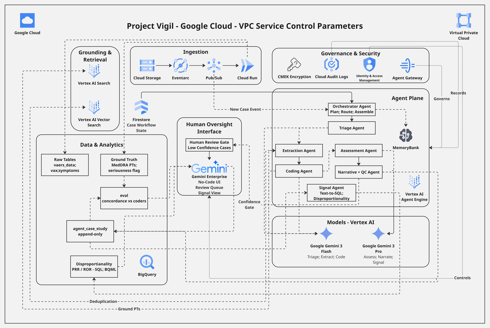

# Project VIGIL

Agentic pharmacovigilance on Google Cloud, built on the public VAERS dataset.
The full capability: data foundation, case processing (triage -> extraction ->
grounded MedDRA coding -> assessment with WHO-UMC causality -> narrative + QC),
aggregate signal detection, and the Gemini Enterprise surface - all GCP-native,
no custom UI, measured against human coders.

Built to the project conventions: pure Python (no agent framework in the core),
Pydantic contracts as the single source of truth, append-only audit writes,
compliance-by-design. Model access sits behind one thin interface (`vigil/llm.py`)
so the reasoning logic stays portable even though it runs fully on GCP.



## Layout
```
vigil/
  config.py            env-driven settings + version stamps
  contracts.py         Pydantic models = response_schema AND validation
  normalize.py         pure matching helpers (sex/age/product) + coding F1
  clients.py           GCP client factories + thin BigQuery layer
  llm.py               StructuredLLM - the only Gemini-aware code
  grounding.py         Grounder interface + embedding retriever over the PT list
  triage_agent.py      Phase 3 agent (validity + seriousness screen)
  extraction_agent.py  Phase 1 agent (plain Python)
  coding_agent.py      Phase 2 agent (grounded MedDRA coding)
  assessment_agent.py  Phase 3 agent (seriousness + WHO-UMC causality)
  narrative_qc_agent.py Phase 3 agent (case narrative + QC)
  signal_agent.py      Phase 4 agent (guarded text-to-SQL disproportionality)
  sql_guard.py         read-only SQL validator (sqlglot)
  orchestrator.py      Phase 3 - chains all five agents, append-only
  pipeline.py          Phase 1/2 single-case runner (extraction -> coding)
  loader.py            Phase 0: CSV -> GCS -> BQ raw -> reference + slice
  evaluation.py        extraction / coding / seriousness concordance
scripts/
  apply_ddl.py         apply sql/data_model.sql statement-by-statement
  phase0_load.py       load VAERS + build foundation
  phase1_run.py        extraction + scorecard
  phase2_run.py        extraction + grounded coding + MedDRA F1
  phase3_run.py        full pipeline (5 agents) + F1 + seriousness + causality
  phase4_run.py        signal agent: ask a question -> guarded SQL -> summary
deploy/
  GEMINI-ENTERPRISE.md how the no-code UI is configured (review queue + signals)
  adk_app.py           ADK adapter skeleton (the only framework-aware code)
sql/data_model.sql     full BigQuery data model (9 tables + 8 views)
agent-contracts.json   JSON Schema registry for all agents
tests/
  test_local.py        Phase 0/1 (21 checks)
  test_phase2.py       Phase 2 (22 checks)
  test_phase3.py       Phase 3 (19 checks)
  test_phase4.py       Phase 4 (17 checks)
```

## Prerequisites
- A GCP project with BigQuery, Vertex AI, and (optional) Cloud Storage enabled.
- `gcloud auth application-default login`
- `pip install -r requirements.txt`
- Download a VAERS year from https://vaers.hhs.gov/data/datasets.html
  (the zip contains `<YEAR>VAERSDATA.csv`, `<YEAR>VAERSVAX.csv`, `<YEAR>VAERSSYMPTOMS.csv`).
- `cp .env.example .env`, edit it, then `source .env`. Create the BQ dataset:
  `bq mk --location=$VIGIL_LOCATION $VIGIL_PROJECT:$VIGIL_DATASET`

## Run
```bash
# 0a. create tables + views
python -m scripts.apply_ddl

# 0b. load VAERS and derive scope / PT list / demo slice
python -m scripts.phase0_load \
    --data 2024VAERSDATA.csv --vax 2024VAERSVAX.csv --symptoms 2024VAERSSYMPTOMS.csv

# 1. run the extraction agent over the slice and score it
python -m scripts.phase1_run --n 200

# 2. run extraction + grounded MedDRA coding and score F1 vs human coders
python -m scripts.phase2_run --n 200

# 3. run the full pipeline (triage -> extraction -> coding -> assessment ->
#    narrative+QC) and score coding F1 + seriousness accuracy
python -m scripts.phase3_run --n 200

# 4. aggregate signal detection - ask a question in natural language
python -m scripts.phase4_run --question "Strongest signals for the in-scope product?"
```

`phase1_run` prints extraction concordance. `phase2_run` prints MedDRA coding
F1. `phase3_run` prints coding F1 + seriousness accuracy vs human coders and
the causality distribution. `phase4_run` generates a guarded read-only SELECT
over `vw_signal_metrics`, runs it, and prints PRR/ROR signals plus a cautious
summary. The Gemini Enterprise surface is configured per `deploy/GEMINI-ENTERPRISE.md`.

## What this build proves
- The full GCP-native capability: case processing (5 agents, orchestrated,
  append-only) + aggregate signal detection, surfaced with no custom UI.
- Strict typed contracts that both constrain Gemini output and validate storage.
- Two measured concordance signals vs human coders (coding F1, seriousness
  accuracy); causality shown with rationale, not scored.
- Safe agentic text-to-SQL: generated SQL is validated read-only against a
  single curated view before execution.
- Portability discipline: the only framework-aware code is the ADK deploy
  adapter; the core is plain Python behind thin LLM / grounding / SQL boundaries.

## Verified offline (79 checks, no GCP)
`test_local.py` (21), `test_phase2.py` (22), `test_phase3.py` (19),
`test_phase4.py` (17) cover the contracts, matching + F1 rules, the SQL guard,
every agent (fake LLM / grounder / SQL runner), and the full orchestrator chain
with fakes. All cloud-touching modules are import/compile-checked.

## Beyond this build
Deploy the ADK adapter to Agent Engine and register in Gemini Enterprise; swap
the embedding grounder for a Vertex AI Search datastore (same `Grounder`
interface); snapshot the eval/signal views into frozen tables at run-close for
point-in-time audit; add prompt/version A-B eval using `pipeline_version`.

## Notes
- Confirm the exact Gemini 3 model IDs in your Model Garden; they're config-driven.
- For a clean rebuild, drop and recreate the dataset, then re-run `apply_ddl`.
- For a frozen, point-in-time audit score, snapshot the eval views into tables
  at run-close (the views are live by default).
